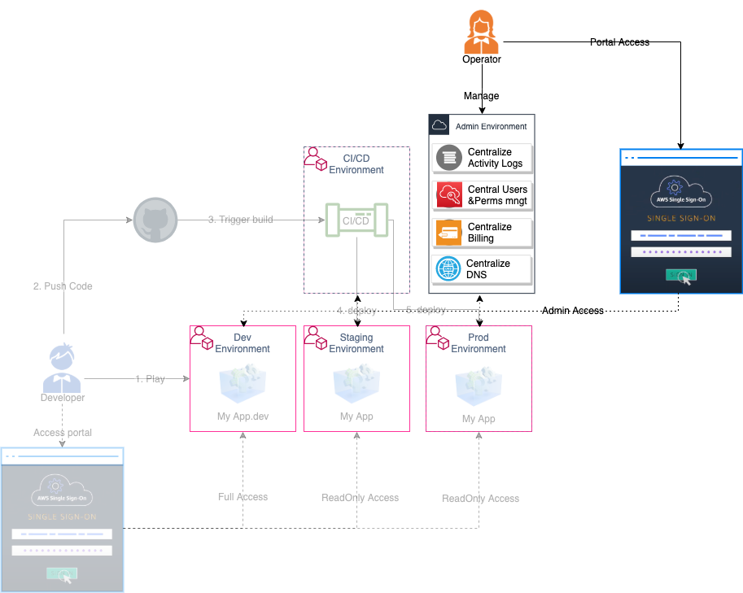
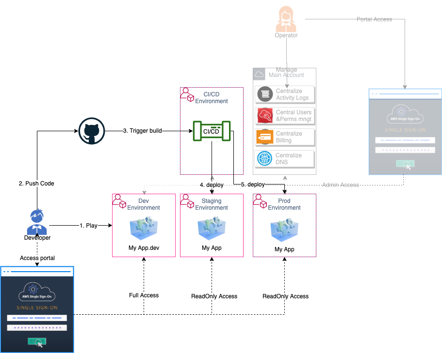

# AWS Bootstrap Kit Examples Overview

- [AWS Bootstrap Kit Examples Overview](#aws-bootstrap-kit-examples-overview)
  * [Who is this for?](#who-is-this-for)
  * [What you will get with it?](#what-you-will-get-with-it)
    + [As an Operator](#as-an-operator)
    + [As a developer](#as-a-developer)
    + [As a developer oncall](#as-a-developer-oncall)
  * [What you will get with it? (the AWS infrastructure)](#what-you-will-get-with-it-the-aws-infrastructure)
  * [Getting started](#getting-started)
  * [Tenets](#tenets)
  * [What you will find in this repository](#what-you-will-find-in-this-repository)
  * [What you won't find in this repository](#what-you-wont-find-in-this-repository)
  * [Do I need to be familiar with the AWS Services used under the hood?](#do-i-need-to-be-familiar-with-the-aws-services-used-under-the-hood)
  * [Concept](#concept)
    + [Infrastructure as Code](#infrastructure-as-code)
    + [CI/CD](#cicd)
    + [Multi accounts strategy](#multi-accounts-strategy)
    + [DNS hierarchy](#dns-hierarchy)
  * [Security](#security)
    + [Control deployment](#control-deployment)
    + [Control access to AWS](#control-access-to-aws)
    + [Minimal security best practices](#minimal-security-best-practices)
  * [Costs](#costs)
  * [Cleaning up accounts](#cleaning-up-accounts)
  * [Known limitations](#known-limitations)
    + [SDLC Organization](#sdlc-organization)

This repository contains examples of using the AWS Bootstrap Kit to set your development and deployment environment on AWS. The AWS Bootstrap Kit is a strongly opinionated CDK set of constructs built for companies looking to follow AWS best practices on Day 1.

Let's start small but with potential for future growth without adding tech debt.

## Who is this for?

Here is the list of the personas targeted by this solution:

* Operators
* Developers
* Oncall developers (aka Ops)

## What you will get with it?

A structured set of environments to develop and operate your software on AWS for your different team roles:

### As an Operator

* An isolated set of secure environments enabling you to ensure the reliability of your system by limiting blast radius of issues (being security, code change, manual operations ...)
* A Web Portal enabling to log in to your different environment (dev, staging, prod, CI/CD ...)
* A central billing system enabling you to control your spend accross your environments
* A central activity view enabling to control what is done across your environments
* A central users and permissions management service enabling you to control what your team members can do or not in your different environments
* An isolated DNS management zone to securely control your main DNS domains

Most of it as Infrastructure as Code artifact.

DNS hierarchy:

### As a developer

* An environment with wide permissions to experiment, test and develop
* A Web Portal enabling to log in to your different environment (dev, staging, prod, CI/CD ...)
* A simple way to add multi stages CI/CD pipeline to deploy securely your code to production
* A simple way to add public DNS records to expose your app or service

### As a developer oncall

* A Web Portal enabling to log in to the different environment you are in charge to monitor

## What you will get with it? (the AWS infrastructure)

Basically the same as above but:
* Environments = [AWS Accounts](https://aws.amazon.com/organizations/faqs/#Organizing_AWS_accounts) (not a *user* account but actually a isolated environment tight to an email (& password) and unique id)
* Set of Environments = Set of AWS Accounts under a main one = [AWS Organizations](https://aws.amazon.com/organizations/faqs/)
* Users and Permissions management solution = [AWS SSO](https://aws.amazon.com/single-sign-on/faqs)
* Login Web Portal = AWS SSO endpoint
* Central Activity logs = Centralized [AWS Cloudtrail](https://docs.aws.amazon.com/awscloudtrail/latest/userguide/cloudtrail-user-guide.html)
* Central Bills = [AWS Consolidated Billing](https://docs.aws.amazon.com/fr_fr/awsaccountbilling/latest/aboutv2/consolidated-billing.html)
* CI/CD Pipeline = [AWS CodePipeline](https://aws.amazon.com/codepipeline)
* Infrastructure as code Artifact = [AWS CDK](https://docs.aws.amazon.com/cdk/latest/guide/home.html) construct/App
* Security monitoring rule = [AWS Config rule](https://aws.amazon.com/config/faq/)
* DNS Zone = [Route53 Public HostedZone](https://docs.aws.amazon.com/Route53/latest/DeveloperGuide/AboutHZWorkingWith.html)

Here is a diagram showing the different services involved and how they are interconnected.

## Getting started

Let's deploy your [Software Development Life Cycle Organization](./source/1-SDLC-organization/README.md).

For a full learning path check the [Activate workshop](https://activate.workshop.aws) leveraging the **aws-bootstrap-kit**.

## Tenets

What this setup fight for:

* **Bootstrapping an organization on AWS should be easy**: whatever the size of an organization, bootstrapping it on AWS should be as simple as running a command line

* **AWS best practices is for everyone**: whatever the size of an organization, their end customers deserve a secured, reliable and cost efficient solution so we don't compromise on AWS best practices for simplicity

* **Everything is code** (when possible): infrastructure management is a lot easier and more reliable when everything is managed by code.

* **CI/CD everywhere**: Human is flawed, let's automate any deployment on any stage

* **Think of the future**: what's created by the resources available here aims to limit future tech debt and ease future growth by being easily migratable to large enterprise solutions such as AWS Control Tower.

* **Keep it simple**: keeping things simple is the best way to avoid technical debt

* **Keep it open**: our code is open source so that you can contribute or adapt it to fit your needs

## What you will find in this repository

In this respository, you will find:
* the source code of the examples used in the documentation
  1. the [SDLC Organization CDK app](./source/1-SDLC-organization/README.md) that creates several accounts for you through AWS Organizations and sets up the appropriate centralized audit logs.
  1. the [Landing Page CDK app](./source/2-landing-page/README.md) that demonstrates how to deploy a static web site in the Dev account.
  1. the [Landing Page with Pipeline CDK app](./source/3-landing-page/README.md) that demonstrates how to deploy a static web site accross your Staging and Prod environment thanks to a CI/CD pipeline.

## What you won't find in this repository

If you are looking for the source code of the AWS Bootstrap Kit, go there: https://www.github.com/awslabs/aws-bootstrap-kit. 

## Do I need to be familiar with the AWS Services used under the hood?

No, to set up your multi-account strategy with the AWS Bootstrap Kit, you don't need to be familiar with the AWS services used under the hood. The intent of the AWS Bootstrap Kit is helping you to start quickly, knowing that you are following AWS best practices and can grow further. Of course, over the time, you may need to learn about these services to fine tune your deployment but you don't need to start there.

## Concept

### Infrastructure as Code

The AWS Bootstrap Kit is based on AWS CDK, the AWS Cloud Development Kit, which is a software development framework for defining cloud infrastructure in code and provisioning it through AWS CloudFormation. 

With AWS CDK, you define your cloud resources in a familiar programming language. You don't need to learn the syntax of CloudFormation templates. The AWS CDK supports TypeScript, JavaScript, Python, Java, and C#/.Net. If you want to know more about CDK, please visit [AWS CDK documentation](https://docs.aws.amazon.com/cdk/latest/guide/home.html).

AWS CDK is based on the concept of construct. A construct represents an AWS resource or a set of AWS resources. A low-level construct directly maps to a CloudFormation resource while higher level of construct can represent a set of resources that represents a pattern.

In addition, AWS CDK uses the concept of stack. It is the unit of deployment. All AWS resources defined within the scope of a stack, either directly or indirectly, are provisioned as a single unit. 

### CI/CD

Forcing any deployment to go through CI/CD will enforce repeatability through automation and ensure a high control over production release.

Having multiple stages enable to catch errors and issues early in order to prevent them to reach production.

See how amazon code deployment [automation](https://aws.amazon.com/builders-library/automating-safe-hands-off-deployments/) and [continuous delivery](https://aws.amazon.com/builders-library/going-faster-with-continuous-delivery/) increased velocity.

### Multi accounts strategy

Isolating the different environments involved in software development brings many advantages around least priviledge principle (it will be easy to segregate access to prod environment for instance) or reliability by reducing the blast radius of an issue.

See [official best practices documentation](https://aws.amazon.com/organizations/getting-started/best-practices/) and our [official prescriptive guidance](https://docs.aws.amazon.com/prescriptive-guidance/latest/migration-aws-environment/welcome.html) for more details.

### DNS Hierarchy

Your DNS root domain (`yourdomain.com` for instance) is a resource to particularly protect, however the use of it to expose service to the internet should not be blocked. That is the reason why this solution propose to set it up in an environment only accessible by administrators and set a chain of subzones enabling developers to stay agile.

## Security

### Control deployment

All changes to your organization and services will go through CI/CD based on code change. Therefore access to those code repository needs to be properly secured.

You will see that manual approvals are added by default in CI/CD pipelines giving you a second layer of protection for prod deployments with the need of proper AWS permissions to approve in addition to `git push` permission.

### Control access to AWS

Going with AWS SSO will enforce temporary credentials usage while simplifying developers environment setup.

### Minimal security best practices

In this solution, we included what we think are a minimal set of security best practices:
* Centralized activity log (AWS Cloudtrail accounts' trails centralized to main account) is a must. It enables you to easily control what is done in each account.
* Check on Multi factor authentication for root user (AWS Config rule)
* Creation of a dedicated administrator user to replace root user (IAM user)

## Costs

By default, this solution occurs less than 1$ / month bill (price may slightly vary by region) by focusing more on structure of your accounts and using serverless technology.

## Cleaning up accounts

AWS Bootstrap Kit creates accounts (e.g CICD, Staging, etc.) through AWS Organization. Behind the scene, it uses CloudFormation Custom Resource and AWS Lambda to call [CreateAccount API](https://docs.aws.amazon.com/organizations/latest/APIReference/API_CreateAccount.html). 

However, there is no API to delete or remove accounts. Thus, the created accounts (aka. member accounts) cannot be cleaned up automatically via Custom Resources. You need to delete these accounts manually. The steps below explain how to clean up those accounts. You have to repeat these steps for each account one by one.

1. **Ensure that you have access to the email address of the member account** Without access to email address, you cannot recover root user to close the account. If that is the case, you have to manually delete all created resources. After that, you should create [a Service Control Policy (SCP)](https://docs.aws.amazon.com/organizations/latest/userguide/orgs_manage_policies_scps.html) with deny * on all resources and apply it to all accounts to disable all future access.
2. **Recover root user access in the member account** Follow section "Accessing a member account as the root user" in [this documentation](https://docs.aws.amazon.com/organizations/latest/userguide/orgs_manage_accounts_access.html#orgs_manage_accounts_access-as-root).
3. **Remove the member account from AWS Organization** Follow the instruction on this [documentation](https://docs.aws.amazon.com/organizations/latest/userguide/orgs_manage_accounts_remove.html). In essence, you need to fill required information (e.g. billing) to detach the member account from an existing Organization.    
4. **Delete each account** Sign-in with root credential and go to [Account Setting page](https://console.aws.amazon.com/billing/home?#/account). Scroll down to "Close Account" section. Read and ensure that you understand the information on check box before closing the account. 

If you want to delete the master account (aka. management account). You need to manually delete AWS Organization in the account after you have removed all member accounts. You can find the details on [this documentation](https://docs.aws.amazon.com/organizations/latest/userguide/orgs_manage_org_delete.html). 

## Known limitations

### SDLC Organization

* Rollback of the SDLC Organization is tricky since AWS Accounts can't be easily deleted
* Change of the organization structure is not supported (especially accounts' name needs to stay as is).
* No check will be done on email given the configuration and can't be changed afterwards
* Deployment won't work if:
  * You already have an AWS Organizations setup
  * You already have a [AWS Config recorder](https://docs.aws.amazon.com/config/latest/developerguide/stop-start-recorder.html) (created automatically if you used AWS Config before)
* Auto CDK bootstrap is only done in the original deployment region

## Getting Help

The best way to interact with our team is through GitHub. You can open an issue and choose from one of our templates for bug reports, feature requests, documentation issues, or guidance.

## Next

Let's deploy your [Software Development Life Cycle Organization](./source/1-SDLC-organization/README.md).

