# Path to AWS Control Tower

[AWS Control Tower](https://docs.aws.amazon.com/controltower/latest/userguide/what-is-control-tower.html) provides an easy way to setup a Landing Zone in AWS: it will create a multi-account structure with proper set of permissions (using [AWS SSO](https://docs.aws.amazon.com/singlesignon/latest/userguide/what-is.html)) and guardrails (using [Service Control Policies](https://docs.aws.amazon.com/organizations/latest/userguide/orgs_manage_policies_scps.html) (SCPs) and [AWS Config](https://docs.aws.amazon.com/config/latest/developerguide/WhatIsConfig.html)).

Control Tower focuses on providing a secured multi-accounts environment. It creates multiples AWS resources for you:
- One Organization
- One or two Organizational Units (OUs): Security (mandatory) and Sandbox (optional)
- Two AWS Accounts in the Security OU: Log Archive and Audit
- A directory in AWS SSO
- A set of guardrails: proactive with SCPs and reactive with AWS Config.
- ...
You can get more details on Control Tower [here](https://docs.aws.amazon.com/controltower/latest/userguide/what-is-control-tower.html).

If you need to setup these resources in your AWS environment and get a managed AWS service to govern your AWS Organization and account structure, Control Tower is the recommended solution.

If you already bootstraped your landing zone using the bootstrap kit, this document will guide you through the "migration" to Control Tower.

At the end of this guide, you will have what bootstrap kit created: the Organization, OUs (Shared, SDLC, Prod), accounts (CICD, Dev, Staging, Prod, ...) plus what Control Tower will create (see above).

## Why?

The Bootstrap Kit already set up an organization, multiple accounts and centralized logging and you may wonder why moving to Control Tower. You should consider using Control Tower (and this guide) for the following reasons (not exhaustive):
- Bootstrap Kit aims to be simple and to provide a basic Organization structure, mainly focused on software development lifecycle (stages, CI/CD). Control Tower focuses more on security, compliance and governance. If your AWS environment is growing (more projects, more teams) and you need a stronger governance, Control Tower comes with a number of pre-configured guardrails (SCPs and Config rules). And you can [extend it with conformance packs](https://aws.amazon.com/blogs/mt/extend-aws-control-tower-governance-using-aws-config-conformance-packs/).
- If you wish to use the Control Tower [Account Factory](https://docs.aws.amazon.com/controltower/latest/userguide/account-factory.html) to create accounts. Account Factory is based on [AWS Service Catalog](https://docs.aws.amazon.com/servicecatalog/latest/adminguide/introduction.html) and provides advanced features like [VPC configuration](https://docs.aws.amazon.com/controltower/latest/userguide/configuring-account-factory-with-VPC-settings.html), [automatic deployment of resources](https://aws.amazon.com/blogs/architecture/field-notes-customizing-the-aws-control-tower-account-factory-with-aws-service-catalog/), ...
- If you wish to use the [Account Factory for Terraform](https://docs.aws.amazon.com/controltower/latest/userguide/taf-account-provisioning.html) (AFT) and thus Terraform templates instead of CDK code.
- If you prefer managing your organization using the Control Tower Console rather than infrastucture as code (CDK).

## Prerequisites

**Disclaimer**: This page is only needed when you already have used bootstrap kit to setup your environment. If you start from a blank page or an existing Organization not created by bootstrap kit, refer to the Control Tower documentation.

When you setup a landing zone with Control Tower, it performs some pre-check (see [doc](https://docs.aws.amazon.com/controltower/latest/userguide/getting-started-with-control-tower.html)):

### CloudTrail integration

One of them is about AWS CloudTrail which is enabled by the Bootstrap Kit. CloudTrail must not be enabled for your organization. Otherwise you will get the following warning:

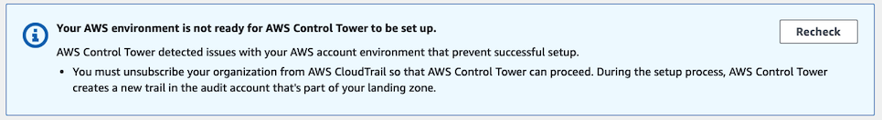

In order to do so, you can use the console or the CLI:

- Using the console, in AWS Organizations > Services > CloudTrail, click on **Disable trusted access** button:

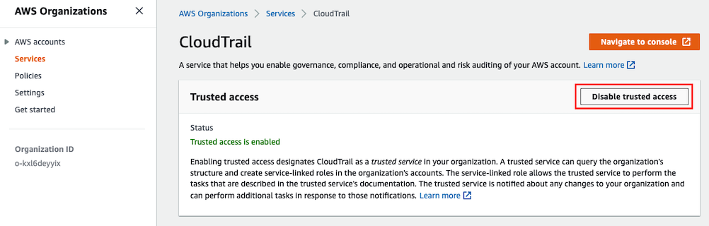

- Using the CLI, type the following command with the Administrator user on the management account:

```shell
$ aws organizations disable-aws-service-access --service-principal cloudtrail.amazonaws.com
```

Note: The CloudTrail trail is not removed, and your CloudTrail logs are not deleted.

### Config integration

Another pre-requisite, which is not checked by Control Tower, but only recommended ([source](https://docs.aws.amazon.com/controltower/latest/userguide/enroll-account.html#enrollment-prerequisites)):
> We recommend that the account should not have an AWS Config configuration recorder or delivery channel. These may be deleted through the AWS CLI before you can enroll an account. Otherwise, see Enroll accounts that have existing AWS Config resources (https://docs.aws.amazon.com/controltower/latest/userguide/existing-config-resources.html) for instructions on how you can modify your existing resources.

If you prefer not to delete these resources, skip these 2 steps and follow the documentation (you will have to create a ticket to support).

#### Configuration Recorder

To remove the Configuration recorder, you can use the following commands:
 1. First retrieve the name of the recorder:
```shell
$ aws configservice describe-configuration-recorders
```
You will get the following result (roleARN will be different in your case):
```shell
{
    "ConfigurationRecorders": [
        {
            "name": "BlueprintConfigRecorder",
            "roleARN": "arn:aws:iam::123456789012:role/Prod-orgStack-SecureRootUserConfigRecorderConfigRe-ZA31CP5DNHZ6",
            "recordingGroup": {
                "allSupported": false,
                "includeGlobalResourceTypes": false,
                "resourceTypes": [
                    "AWS::IAM::User"
                ]
            }
        }
    ]
}
```
 2. Then delete it:
```shell
$ aws configservice delete-configuration-recorder —configuration-recorder-name BlueprintConfigRecorder
```

#### Delivery Channel

To remove the Delivery Channel, you can use the following commands:

 1. First retrieve the channel name:
```shell
$ aws configservice describe-delivery-channels
```
You will get the following result:
```shell
{
    "DeliveryChannels": [
        {
            "name": "ConfigDeliveryChannel",
            "s3BucketName": "prod-orgstack-securerootuserconfigrecorderconfigb-1la87m5r4jl3h"
        }
    ]
}
```
 2. Then delete it:
```shell
$ aws configservice delete-delivery-channel —delivery-channel-name ConfigDeliveryChannel
```

## Control Tower setup

In the AWS Console, go to the AWS Control Tower service. Click on **Set up landing zone**:

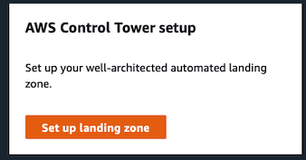

Walk through the wizard:
 1. In step 1, select the region where you will have most of your workloads. You can also deny access to specific regions if you wish to limit your environment to a set of allowed regions.
2. In step 2, configure the OUs you will need. Security is mandatory (you can rename it). Sandbox is optional, and may not be needed as you already have the SDLC OU.
3. In step 3, setup the emails of the log archive and audit accounts.
4. In step 4, review what Control Tower will do and click **Setup up landing zone** button.

Once you validate the setup, Control Tower starts the configuration:

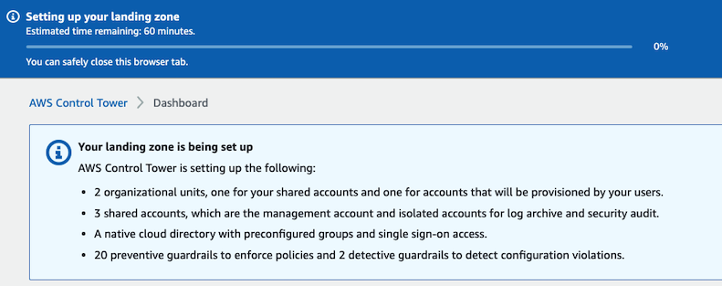

After 10-15 minutes (it can be more in your environment), Control Tower is ready:

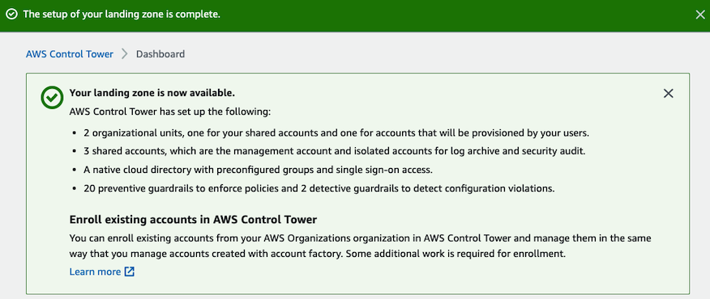

## Finalizing setup

After Control Tower has been enabled in your environment, you should have the following OUs/Accounts structure (may vary if you've added some OUs / Accounts):

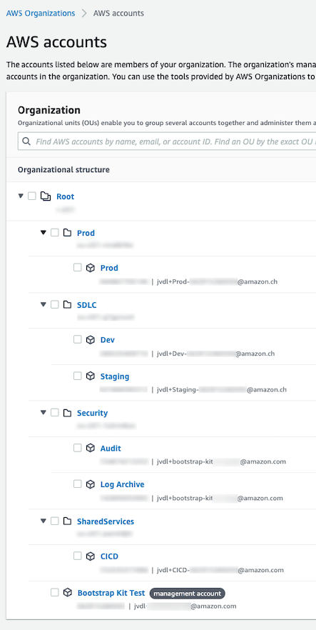

But OUs created by the Bootstrap Kit are not registered in and governed by Control Tower:

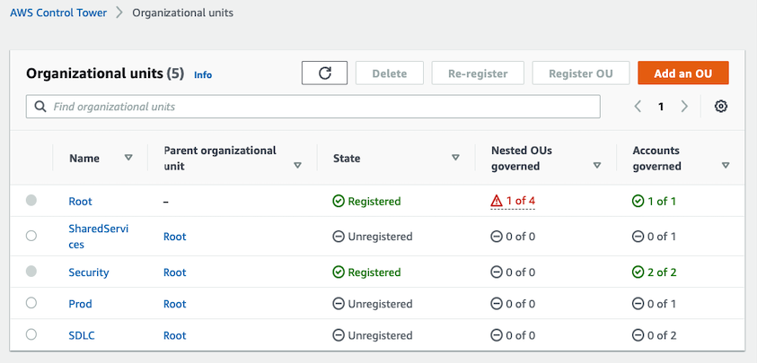

We need to register them manually (see [doc](https://docs.aws.amazon.com/controltower/latest/userguide/how-to-register-existing-ou.html)), as there are no CLI/SDK for Control Tower as of now.

**Note**: it is not possible to register an OU with more than 300 accounts. You can see the number of accounts in the console (see picture above), or use the following commands:

```shell
$ aws organizations list-roots
# retrieve the root id (eg. r-s3b2)

$ aws organizations list-organizational-units-for-parent —parent-id r-s3b2
# retrieve the OU id (eg. ou-s3b2-paml2jci)

$ aws organizations list-accounts-for-parent --parent-id ou-s3b2-paml2jci* | jq '.Accounts | length'
```

In the console, select the OU to be registered and click **Register OU**:

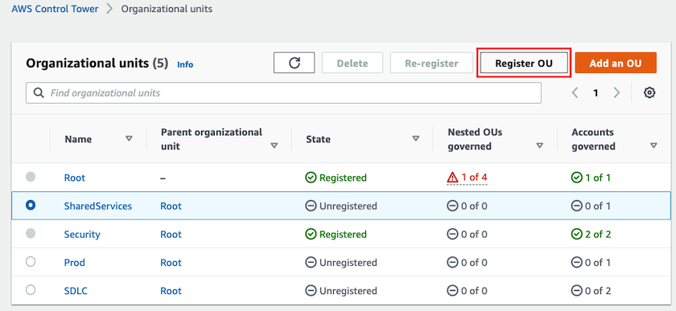

Read carefully the following screen, check the box "In understand the risks..." and click **Register OU**:

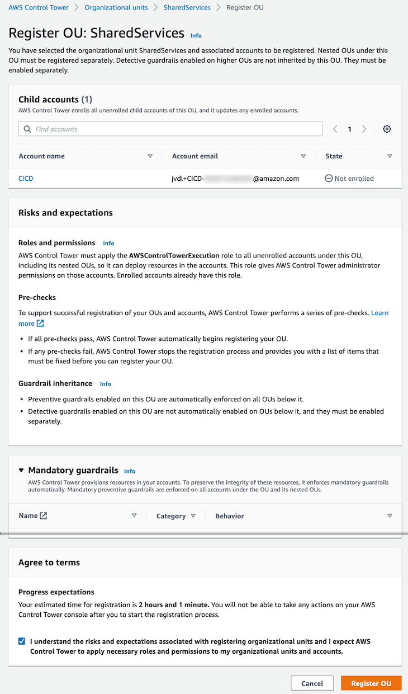

Repeat previous steps for all OUs you want to be governed by Control Tower. Note that you need to wait for an OU to be registered before registering another one.

When all OUs are registered, you should have:

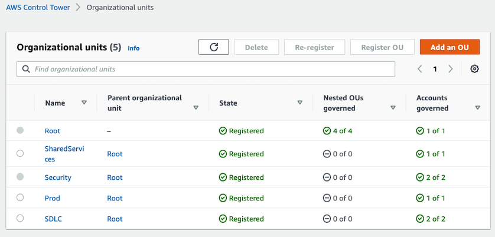

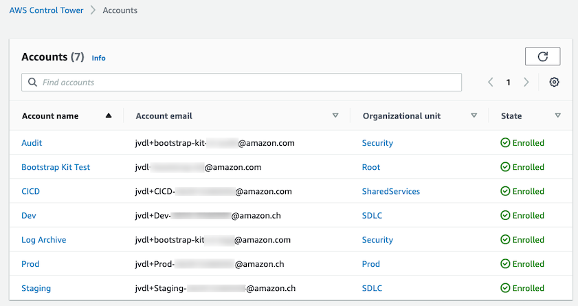

Control Tower is now set up and governs the Bootstrap Kit resources (Org, OUs, accounts).

Note that the Administrator user now has the following permissions: [AWSOrganizationsFullAccess](https://github.com/SummitRoute/aws_managed_policies/blob/master/policies/AWSOrganizationsFullAccess) on the bootstrap kit accounts (instead of AWSAdministratorAccess). See [docs](https://docs.aws.amazon.com/controltower/latest/userguide/sso.html):

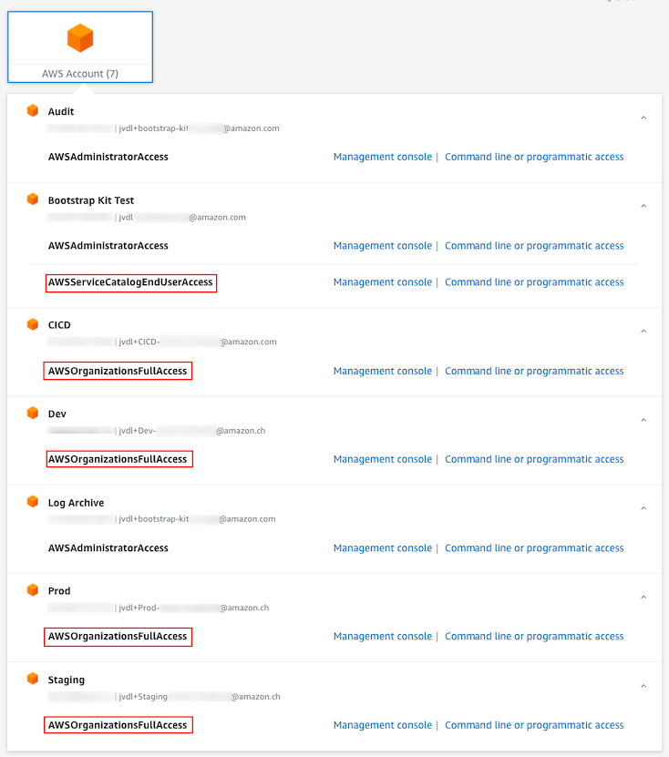