# Welcome to the Landing Page with Pipeline CDK app example

As described in root [README](../../README.md), this [CDK](https://docs.aws.amazon.com/cdk/latest/guide/apps.html) app is an improvement of the [Landing Page CDK app](../2-landing-page/README.md). The example demonstrates how to add a CI/CD pipeline to the app to deploy the static web site on the staging and prod environments (basically the Staging and Prod account) created by the [SDLC Organization CDK app](../1-SDLC-organization/README.md).

## Under the hood

This CDK app adds a new stack, the **LandingPagePipelineStack**, which deploys a CI/CD pipeline orchestrating the deployment of your static web site accross several environments (and thus several AWS accounts as we follow the best practice 1 environment = 1 AWS account).

The **LandingPagePipelineStack** instanciates the following resources:
* An S3 Bucket to store your build assets
* A CodePipeline pipeline to orchestrate the build and deployment of the LandingPageStack accross the Staging and Prod accounts

The CDK application source code is in the `source\3-landing-page-cicd\cdk` folder.

## Deployments

### Prerequisites

* A [GitHub](https://github.com) account
* [npm](https://npmjs.org) and [AWS CLI v2](https://docs.aws.amazon.com/cli/latest/userguide/install-cliv2.html) installed
* A SDLC Organization deployed with the [SDLC Organization CDK app](../1-SDLC-organization/README.md)

### Fork and clone the repository

1. Fork the repository on your GitHub account by clicking [here](https://github.com/aws-samples/aws-bootstrap-kit-examples/fork).

2. Clone the repository locally:
    ```
    git clone https://github.com/<YOUR_GITHUB_ALIAS>/aws-bootstrap-kit-examples
    ```

### Configure a profile with appropriate permissions to deploy a pipeline in the CICD account

If you followed the whole [SDLC Organization CDK app](../1-SDLC-organization/README.md) setup procedure, you have created a user group called **DevOpsEngineers** and you gave it the permission to access the CICD account with the **DevOpsAccess** permission set. If you don't have followed these steps, please run them now as the following steps are based on it.

Right now, the *Developer* user that you are using has no access to the CICD account as it is only member of the *Developers* group. Let's add it to the **DevOpsEngineers** group to give it access to the CICD account with the appropriate permissions.

1. Navigate to your SSO portal Url and sign in with your administrator user

    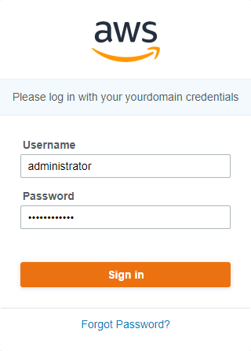

1. Click on the AWS Account card

    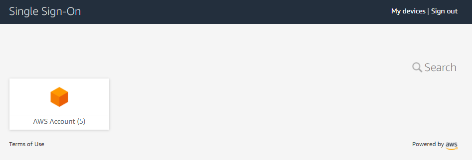

1. Click on the the main account row to expand it

    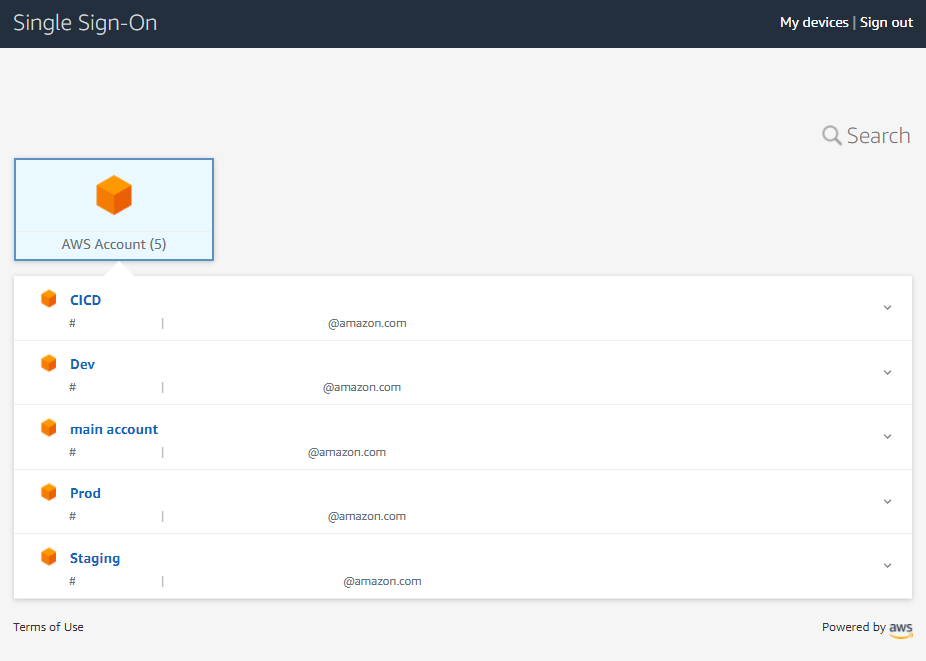

1. Click on the *Management console* link for the **AdministratorAccess** permission set

    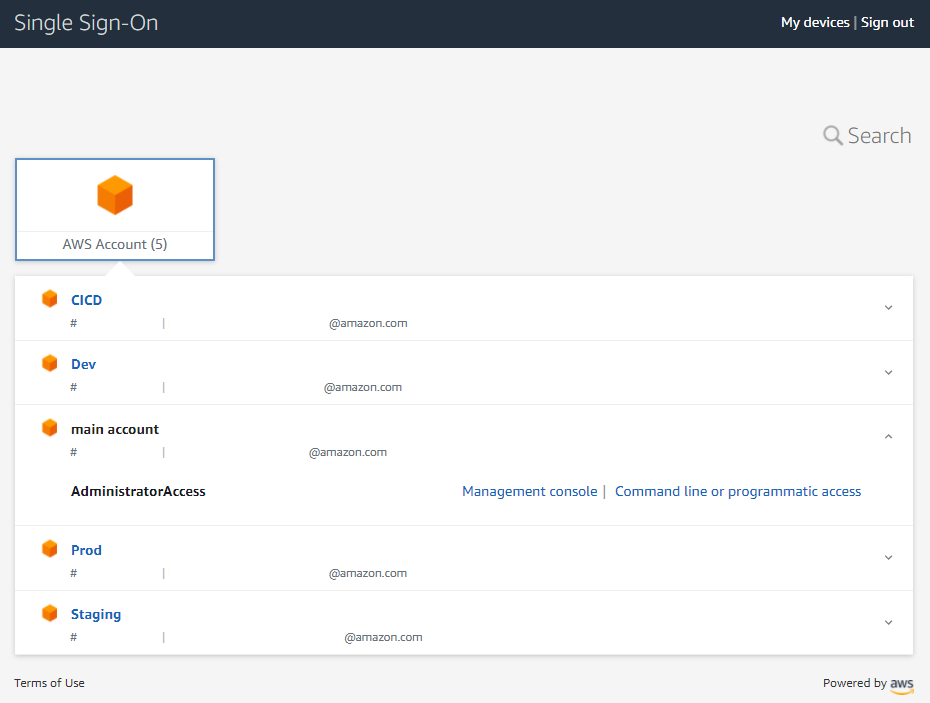

1. Seach for the AWS SSO service thanks to the Find Services field

    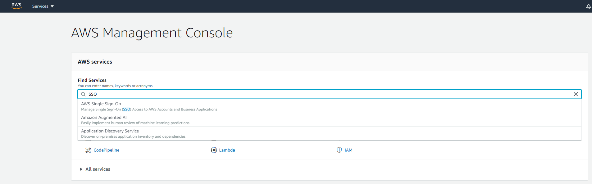

1. Click on Users on the left side menu

    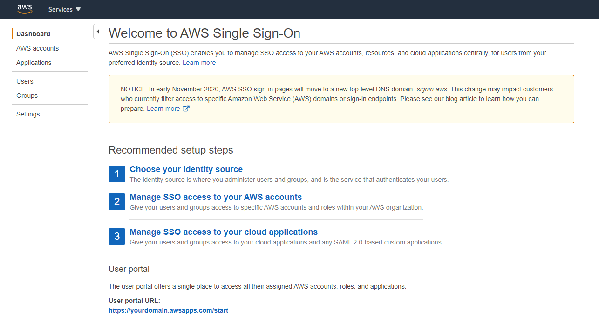

1. Click on the Developer user

    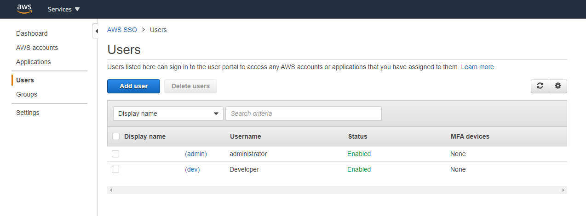

1. Click on the Groups tab

    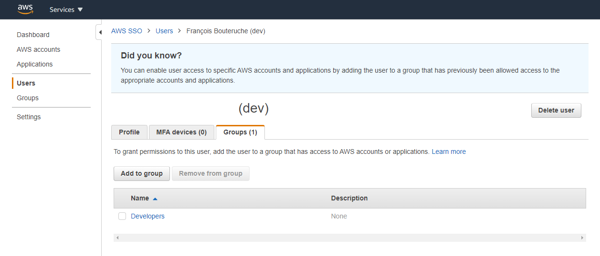

1. Select the **DevOpsEngineers** group and click on the *Add to 1 group(s)* button

    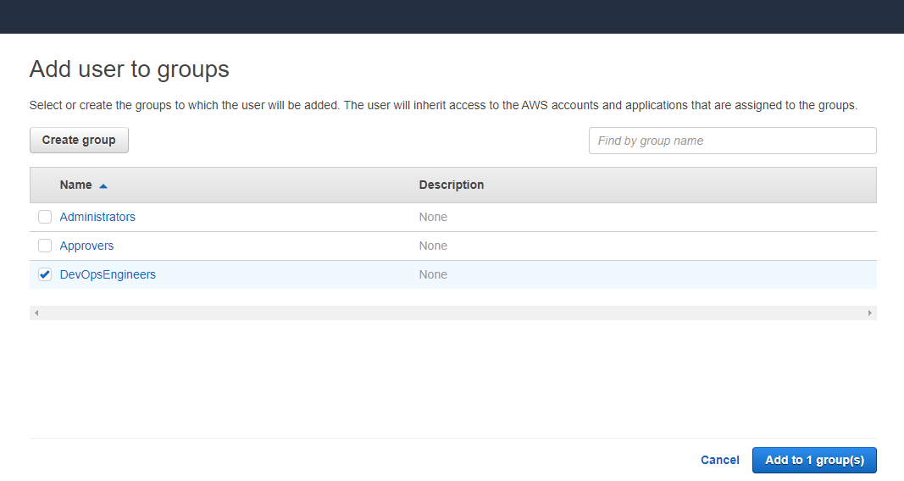

1. Go back to your SSO portal and click on *Sign out*

    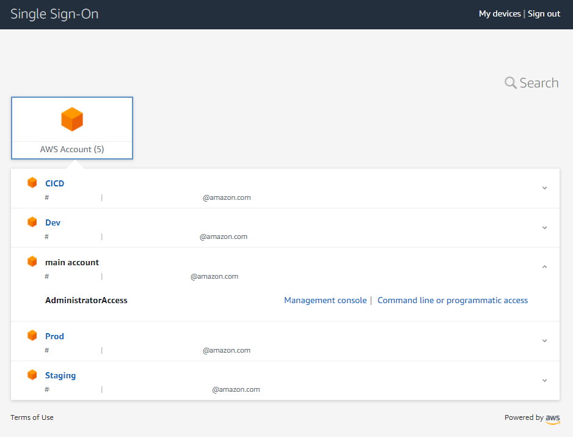

1. Execute `aws configure sso --profile cicd` and follow the instructions

1. When you are asked to sign in in a web browser, use your Developer credentials

    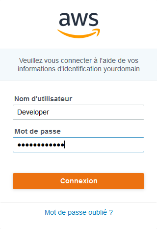

1. Click on the *Sign in to AWS CLI* button

    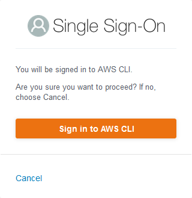

1. You can close your browser

    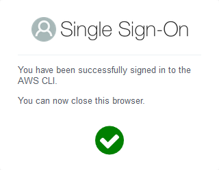

1. Go back to your shell and select the CICD account

    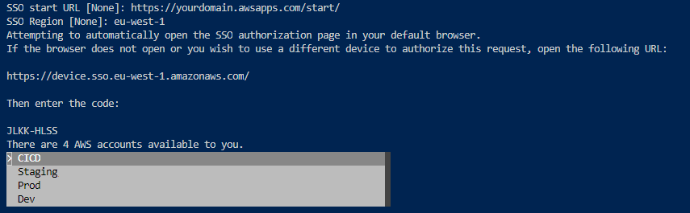

1. Enter the default region where you want to deploy, e.g. eu-west-1, and your default output format, e.g. json

    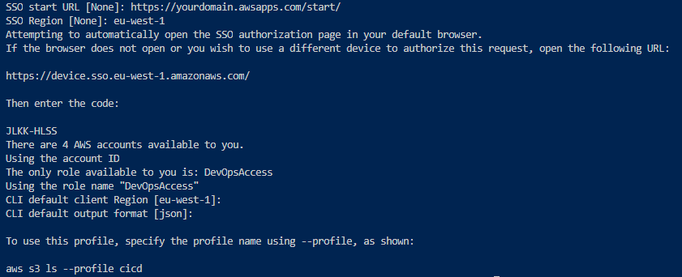

1. Execute `npm install -g cdk-sso-sync`

    > Right now the cdk cli is not SSO friendly so we use a small command line tool to synchronize SSO credential with standard aws cli credential so that cdk can use a SSO profile

1. Execute `cdk-sso-sync cicd`

### Create a secret with your GitHub Personal Access Token in the CICD account

When you have gone through the [SDLC Organization CDK app](../1-SDLC-organization/README.md) setup procedure, you have created a secret in AWS Secrets Manager in your main account to store your GitHub Personal Access Token. The secret is only accessible from the main account.

Now, we have to create the same secret in the *CICD* account so that the CodePipeline service can access the source code in your GitHub repository.

```
aws --profile cicd secretsmanager create-secret --name GITHUB_TOKEN --secret-string <YOUR_GITHUB_PERSONAL_ACCESS_TOKEN>
```

### Update the cdk.json file parameters

1. You must update the following values in your *source/3-landing-page-with-cicd/cdk/cdk.json* file:

    * "github_alias": <YOUR_GITHUB_ALIAS>
    * "github_repo_name": <YOUR_GITHUB_REPOSITORY>,
    * "github_repo_branch": <YOUR_GITHUB_BRANCH>


### Install dependencies

1. Go to the *3-landing-page-cicd* folder

    ```
    cd source/3-landing-page-cicd/cdk
    ```

1. Install dependencies

    ```
    npm install
    ```

### Deploy the **LandingPagePipelineStack**

1. Build the CDK application
    ```
    npm run build
    ```

1. Deploy default stack of the CDK application, the **LandingPagePipelineStack** one.
    ```
    cdk deploy --profile cicd
    ```

### Destroy the **LandingPagePipelineStack**

You can easily destroy the **LandingPagePipelineStack** and free up the deployed AWS resources on the CICD account:

```
cdk destroy --profile cicd
```

> Deleting the pipeline stack doesn't delete the **LandingPageStack** from the Staging and Prod accounts. You have to delete them manually whether through the AWS CloudFormation console or the AWS CLI.


### Troubleshooting

* If you get an CloudFormation Internal Failure error while deploying the stack, please check you have properly created the GITHUB_TOKEN secret
* If you get an error 400 message as a detailed error message when CodeBuild fails, please check you have properly modify your cdk.json file
* If you get an error message stating *Cannot have more thant 1 builds in queue for the account* as a detailed error message when CodeBuild fails, please retry the step in CodePipeline. You are reaching a limit due to the fact that your AWS account is new. You can make a support request to increase the limit.