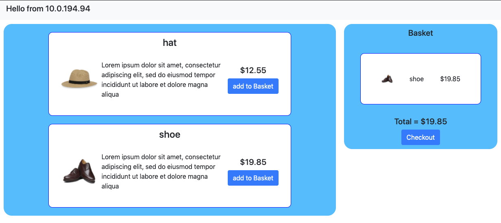
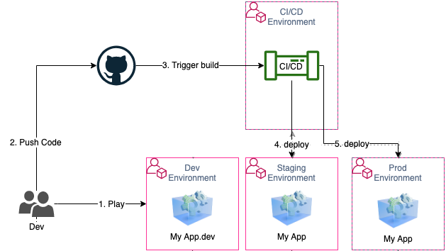

# Fullstack Ecommerce CDK APP With CICD

This demonstrates an example of CDK being used for SDLC, what is being built:

1. CICD Pipeline Stack
2. Ecommerce App Infrastructure Stack

## CICD Pipeline Stack

The pipeline created consists of several stages:

1. fetching code from repository
2. building the code
3. deployment stage: deploying the Ecommerce Infrastructure using CDK along with deployment of Ecommerce App

## Ecommerce App Infrastructure Stack

- Cloud Front Distribution for S3 Bucket storing image assets
- Aurora Serverless with MySQL Engine for products details
- Fargate for serverless ECS to run our dockerized App
- A simple PHP App container with NGINX proxy container
- Cloud Watch Dashboard to monitor services

> Be aware that there are 2 seperate CDK Code, one which you deployed locally that only sets up the pipeline `Pipeline Stack`, the second one `Infrastructure Stack` is used by the pipeline to set up the App's Infrastucture

# Prerequisites

- A [GitHub](https://github.com) account
- [npm](https://npmjs.org) and [AWS CLI v2](https://docs.aws.amazon.com/cli/latest/userguide/install-cliv2.html) installed
- A SDLC Organization deployed with the [SDLC Organization CDK app](../1-SDLC-organization/README.md)

## Fork and clone the repository

1. Fork the repository on your GitHub account by clicking [here](https://github.com/aws-samples/aws-bootstrap-kit-examples/fork).

2. Clone the repository locally:
   ```
   git clone https://github.com/<YOUR_GITHUB_ALIAS>/aws-bootstrap-kit-examples
   ```

## Update the cdk.json file parameters

1. You must update the following values in your _source/4-containerized-service/cdk/cdk.json_ file:

   - "github_alias": <YOUR_GITHUB_ALIAS>
   - "github_repo_name": <YOUR_GITHUB_REPOSITORY>,
   - "github_repo_branch": <YOUR_GITHUB_BRANCH>

## Install dependencies

1. Go to the _4-containerized-service_ folder

   ```
   cd source/4-containerized-service/cdk
   ```

1. Install dependencies

   ```
   npm install
   ```

## Deploy the **PipelineStack**

1. Build the CDK application

   ```
   npm run build
   ```

1. Deploy the **PipelineStack**, which will then deploy **InfrastructureStack** to your Staging & Prod Environments
   ```
   cdk deploy --profile cicd
   ```

## Destroy the **PipelineStack**

You can easily destroy the **PipelineStack** and free up the deployed AWS resources on the CICD account:

```
cdk destroy --profile cicd
```

> Deleting the pipeline stack doesn't delete the **InfrastructureStack** from the Staging and Prod accounts. You have to delete them manually whether through the AWS CloudFormation console or the AWS CLI.

## Troubleshooting

- If you get a CloudFormation Internal Failure error while deploying the stack, please check you have properly created the GITHUB_TOKEN secret
- If you get an error 400 message as a detailed error message when CodeBuild fails, please check you have properly modified your cdk.json file
- If you get an error message stating _Cannot have more thant 1 build in queue for the account_ as a detailed error message when CodeBuild fails, please retry the step in CodePipeline. You are reaching a limit due to the fact that your AWS account is new. You can make a support request to increase the limit.

# WalkThrough

## Ecommerce App

The objective is to create a simple ecommerce app that would cover most of the requirements a typical Web App would need.

The app consists of the following:

- Vanilla Frontend
- PHP Backend
- Dockerized NGINX as proxy server
- Dockerized PHP-FPM (FastCGI Process Manager) to process requests
- MySQL Database
- Static Assets i.e product images

### Vanilla Frontend

The Frontend app will be a static vanila web app served by our backend. The home page as displayed below lists a few products which can be added to basket and then on checkout the user will be redirected to a Stripe payment platform, which on Success/Failure will then be redirected to our Success/Failure Page.



There are mainly 2 endpoints that are called:

- `/get-products.php` to list all products available on homepage
- `/create-session.php` to create a session with Stripe that includes purchase details when checking out

Finally there are 2 more static web files:

- Success Page: to confirm purchase was successful
- Failure Page: to inform purchase was not successful

### Dockerized NGINX & PHP-FPM

To run PHP, a combination of a web server and FastCGI is required. In this example we chose to use a popular combination of NGINX and PHP-FPM. It is recommended when running more than one process to containerize each process seperately and therefore we created seperate docker files

### PHP Backend

As mentioned we required 2 main endpoints:

#### /get-products.php

This endpoint is straightforward, it just connects to our MySQL Database using PDO (PHP Data Objects)

```
$conn = new PDO("mysql:host=$host;dbname=$dbName", $username, $password);
```

and then fetches all the products with a simple SQL Select Statement

```
$stmt = $conn->prepare("SELECT * FROM products");
$result = $stmt->fetchAll();
```

and then returns the result as a JSON response

```
$json_response = json_encode($result);
echo $json_response;
```

#### /create-session.php

This endpoint is called after a user has added their products into their basket and clicked the checkout button, the queryString contains the list of productIds. Our endpoint will query the database for these Ids

```
$query = $_GET['ids'];

$ids = json_decode($query);
$questionMarks  = str_repeat('?,', count($ids) - 1) . '?';
$stmt = $conn->prepare("SELECT * FROM products where productId in ($questionMarks)");
$stmt->execute($ids)
```

Stripe endpoint is called to create a session with product details

```
\Stripe\Stripe::setApiKey('sk_test_4eC39HqLyjWDarjtT1zdp7dc'); // STRIPE TEST API KEY

$checkout_session = \Stripe\Checkout\Session::create([
  'payment_method_types' => ['card'],
  'line_items' => [[
    'price_data' => [
      'currency' => 'usd',
      ...

echo json_encode(['id' => $checkout_session->id]);
```

Finally the sessionId is returned to the Client, to pass along when redirecting the user to the stripe platform

### MySQL Database

A simple MySQL is required to store the products details with the following schema:

```
+-----------+--------------+
| Field     | Type         |
+-----------+--------------+
| productId | int          |
| name      | varchar(255) |
| image     | varchar(255) |
| price     | decimal(5,2) |
+-----------+--------------+

```

On the cloud we will use Aurora Serverless which is MySQL Compatible, but for local development we will use a MySQL Docker Image and an SQL dump file to prepopulate it

### Run Locally

To develop and run locally we will use docker-compose to run all three images as seen below:

```
services:
  web:
    build: ./nginx/
    ports:
      - '8080:80'
    environment:
      PHP_HOST: 'php'
    links:
      - php
  php:
    build: ./php-fpm/
    ports:
      - '9000:9000'
  db:
      image: mysql
      ...
```

one of the challenges faced when running locally, is that containers cannot communicate directly through localhost and hence we use docker's bridge network mode to link them as can be seen in docker-compose above, which then means the NGINX config file needs to point to host `php` instead of `localhost` and that is fine locally, however Fargate doesn't operate in bridge network mode so there is no linking feature available. Instead Fargate uses a special container networking mode called awsvpc, which gives all the containers in a task a shared network interface to use for communication directly, therefore you would need the NGINX to point to `localhost` in this scenario.

There is a sophisticated way to solve this by is adding another container locally that can simulate the `awsvpc` network mode and if you are interested you can read this [article](https://aws.amazon.com/blogs/compute/a-guide-to-locally-testing-containers-with-amazon-ecs-local-endpoints-and-docker-compose/) for more explanation, Scenario 4 addresses our situation.

Howerver I chose a simpler work around to just pass an environment variable to determine the host to point to based on each scenario. by default NGINX doesn't work with environment variable, however the NGINX Docker Image added a nice templating feature which can transpile it into a config file with the variables rendered as you see in below config sample

```
server {
  listen       80;
  ...
  location / {
    fastcgi_pass   ${PHP_HOST}:9000;
    fastcgi_index  index.php;
    ...
```

so just run this single command and it will spin up the App running on `localhost:8080` :

```
docker-compose up
```

## Pipeline Stack

From here on we will be using CDK to set up our infrastructure on the Cloud and as mentioned previously we split our CDK code into 2 stacks, the first one being the Pipeline stack, this is will be deployed to our CICD Environment and will be responsible for deploying our App's Infrastructure Stack to other environments, in our case it will be Staging and Prod.



so let's take look go through [pipeline-stack.ts](./cdk/pipeline-stack.ts)
we will be using [CdkPipeline](https://docs.aws.amazon.com/cdk/api/latest/docs/aws-codepipeline-readme.html) Construct to set up our pipeline

below we are passing a sourceAction property to defing our code source which in our case is a GitHub repo and second property is synthAction to define build commands.

```
const pipeline = new CdkPipeline(this, "Pipeline", {
  sourceAction: new codepipeline_actions.GitHubSourceAction({
    actionName: "GitHub",
    repo: this.node.tryGetContext("github_repo_name"),
    ...
  }),
  synthAction: SimpleSynthAction.standardNpmSynth({
    subdirectory: "source/3-landing-page-cicd/cdk",
    installCommand: "npm install",
    buildCommand: "npm run build",
    rolePolicyStatements: [
      new PolicyStatement({
        actions: ["organizations:ListAccounts"],
        resources: ["*"],
      }),
    ],
  }),
});
```

standardNpmSynth builds using NPM and runs `cdk synth` by default, the last property used rolePolicyStatements will give us the authority to list AWS Accounts, which will be handy later

so far our pipeline has two stages a source stage and a build stage, now we need a stage that actually deploys our infrastructure code into its destination environments using Pipeline's `addApplicationStage` method

```
const infraStage = new InfrastructureStage(this, stageDetails.name, {
  env: { account: accountId },
});
const applicationStage = pipeline.addApplicationStage(infraStage, {
  manualApprovals: true,
});
applicationStage.addActions(
  new ShellScriptAction({
    actionName: "E2E_Testing",
    commands: ["curl -Ssf $URL/info.php"],
    useOutputs: {
      URL: pipeline.stackOutput(infraStage.loadBalancerAddress),
    },
  })
);
```

First we actually call our Infrastructure Stack that will be deployed by our pipeline and specify the accountId for the environment we are deploying to, whether it is Staging or Prod.
The manualApproval flag determines whether the actual deployment needs to be manually approved first, basically adding a human action in the process.

Finally an End to End Testing is created by adding an additonal Action, this allows me set up a simple shell script, which in this scenario runs a simple curl command to check that service is up. but in order to run the curl command we need to know what our endpoint will be and this is available in our pipeline's stackOutput which is provided by our stack and passed to the pipeline using CfnOutput, we will discuss this later when going through our infrastructure stack

So far this explains how to deploy to a particular environment, but now we need to run this for each environment. so the plan is to first list all the accounts and this is where we gave ourselves the permission to do so in the rolePolicyStatement as we mentioned earlier in `standardNpmSynth`. so we will take our previous code for adding the Stage and wrap it in this loop below going through each environment listed

```
const orders: any = { "WorkloadA-Beta": 1, "WorkloadA-Prod": 2 };
const orgs = new Organizations({ region: "us-east-1" });
const { Accounts = [] } = await orgs.listAccounts().promise();

Accounts.filter((account) => orders[account.Name!])
   .sort((a, b) => orders[a.Name!] - orders[b.Name!])
   .forEach((account) => {
   // addApplicationStage for each Environment
});
```

> you'll notice in the actual code, I added a condition to only have manual Approvals for Prod Environmet, and therefore all environment will be deployed automatically except for Prod, it will require someone to manually approve.

Finally to actually to deploy our pipeline you just need to run the following commands

```
npm run build
npm run cdk synth
npm run cdk deploy --profile cicd
```

Unlike your main Infrastructure Stack, your Pipeline will not be redeployed when changes are pushed to your Repo, you will need to redeploy it via the command line locally everytime as there is no pipeline to redeploy your pipeline. However the Pipeline Construct has a nice feature called selfMutate which actually addresses this need with a selfMutating prop which is true by default, but in my code I passed in a false value to make the objective of this feature clear and noticable, so if you just delete this one line I added which is `selfMutating: false,` you will notice a new stage created in the pipeline called self-Mutate and this will check if the pipeline needs updating and then updates itself before moving on

## Infrasctructure Stack

This is the second CDK Stack that builds our Ecommerce Infrasctructure as seen in diagram


Our Infrastructure will consist of the following:

- S3 to store our image assets
- CloudFront to distribute assets stored in our S3 bucket
- Aurora Serverless (MySQL) Database
- ECS (Fargate) a serverless container orchestration service to run our containerized apps, mainly the NGINX and PHP-FPM Containers
- CloudWatch Dashboard to monitor and log our services

### VPC

Ofcoarse nothing can be created in AWS without having our VPC first, with this construct I can define our VPC and also specify the Availabilty Zones it will cover, in our current design it will be 2 Availability Zones

```
const vpc = new Vpc(this, "MyVpc", { maxAzs: 2 });
```

### S3 and CloudFront

Normally to serve static content, you would need to set up and configure S3 and CloudFront seperately, but one the many advantages of CDK is that you can build and share your own combination of constructs and in our [AWS Solutions Constructs](https://docs.aws.amazon.com/solutions/latest/constructs) there many constructs open sourced for us to use, and I will be using `aws-cloud-s3` which does this out of the box with just one line

```
const cloudFront = new CloudFrontToS3(this, "my-cloudfront-s3", {});
```

One more thing to add, currently our new bucket created will be empty and for our App to work out of the box, we need to bootsrap it with a few images, this is where our [Bucketdeployment](https://docs.aws.amazon.com/cdk/api/latest/docs/aws-s3-deployment-readme.html) Construct can be used

```
new BucketDeployment(this, "DeployS3Images", {
  sources: [Source.asset("./static")],
  destinationBucket: cloudFront.s3Bucket!,
  destinationKeyPrefix: "static",
});
```

### Aurora Serverless MySQL

The [Serverless Cluster](https://docs.aws.amazon.com/cdk/api/latest/docs/@aws-cdk_aws-rds.ServerlessCluster.html) Construct below creates our Database specifying that we require a MySQL Enging and enabling the HttpEndpoint will switch on the Data API feature which will makes SQL requests easier using http instead of managing connections

```
const db = new ServerlessCluster(this, "MyDatabase", {
  engine: DatabaseClusterEngine.AURORA_MYSQL,
  defaultDatabaseName: "ecommerce",
  enableHttpEndpoint: true,
  vpc,
});
```

However same issue we had previously the Database is empty, so for our App to work out of the box, we need to prepopulate it with a few products and our Construct doesn't provide a method to do that.
In such scenarios you can use [CustomResources](https://docs.aws.amazon.com/cdk/api/latest/docs/custom-resources-readme.html), CloudFormation sends lifecycle events to CustomResources and therefore you can add handlers to events like in our case would be the create event, and [AwsCustomResources](https://docs.aws.amazon.com/cdk/api/latest/docs/@aws-cdk_custom-resources.AwsCustomResource.html) is a type of CustomeResources that allows you to use AWS SDK to make api calls, so in our case we will execute 2 SQL Statements, first one to create a table and second one to insert a few products.

```
const createTable = new AwsCustomResource(this, "CreateTable", {
  onCreate: {
    service: "RDSDataService",
    action: "executeStatement",
    parameters: {
      resourceArn: db.clusterArn,
      secretArn: db.secret?.secretArn,
      database: "ecommerce",
      sql:
        "CREATE TABLE products ( productId int, name varchar(255), image varchar(255), price decimal(5, 2) );",
        ...

const insertTable = new AwsCustomResource(this, "InsertTable", {
   ...
```

To ensure that first one runs before the other we can add one as a dependant to the other

```
insertTable.node.addDependency(createTable);
```

### Container Orchestration using ECS (Fargate)

To give a brief description ECS (Elastic Container Service) is our Container orchestration service and Fargate is a layer added to make ECS Serverless and therefore takes over all the heavylifting of configuring ECS. these are the main components we are dealing with:

- ECS Cluster
- Fargate Service
- LoadBalancer
- Task Definitions that defines our Containers

There a nice Construct that sets up alot under the hood [ApplicationLoadBalancedFargateService](https://docs.aws.amazon.com/cdk/api/latest/docs/@aws-cdk_aws-ecs-patterns.ApplicationLoadBalancedFargateService.html) and this sets up a Fargate service running on an ECS cluster fronted by an application load balancer, and a Nat Gateway for our containers to be able to send request to our 3rd party payment service

```
const fargateService = new ApplicationLoadBalancedFargateService(
  this,
  "MyFargateService",
  {
    cluster: cluster, // the ECS Cluster
    desiredCount: 2, // desired amount of Tasks
    taskDefinition,
    publicLoadBalancer: true,
  }
);
```

ECS run Tasks which can contain more than one containers, so we defined a desiredCount of 2 Tasks and the loadBalancer will distribute traffic to them, as you might have noticed in our FrontEnd Image the Ip address of the container is displayed and everytime you refresh it changes showing you the loadbalancing in action.
As mentioned prevously we seperated our processes into 2 containers, but even though they are seperate they are still tightly couple as for every PHP-FPM process you need an NGINX proxy infront of it, therefore we put both containers together into one Task.

So we create a task definition and add both containers

```
const taskDefinition = new FargateTaskDefinition(this, "TaskDef");
const nginxContainer = taskDefinition.addContainer("ab-nginx", {
  image: ContainerImage.fromAsset(__dirname + "/../../nginx"),
  environment: {
    PHP_HOST: 'localhost'
  },
  logging: new AwsLogDriver({ streamPrefix: "myNGINX" }),
  ...
});
```

The amazing benefit with this construct is instead of manually dealing with an image registery to upload your docker images and then figure out how to fetch and build them for your Container service, instead it can abstract all that away from you and you just need to use the `ContainerImage.fromAsset` to point to where you Dockerfile is.

The environment property allows you to pass any environment variable to your containers.

> Notice the NGINX container will point to `localhost` as discussed earlier due to the `awsvpc` network mode

and to keep track of logging we add a logDriver, which later we can use in our CloudWatch Dashboard to monitor our container's output

now for our PHPContainer, we have a few extra properties

```
const phpContainer = taskDefinition.addContainer("ab-php", {
  image: ContainerImage.fromAsset(__dirname + "/../../php-fpm"),
  environment: {
    DOMAIN: "http://" + fargateService.loadBalancer.loadBalancerDnsName,
  },
  secrets: {
    SECRETS: Secret.fromSecretsManager(db.secret!),
  },
});
```

For environment variables we need to have our domain endpoint to be used for our App's Success/Failure redirect URLs, which will be the loadBalancer's DNS name. This is one of the perks of using CDK, you take advantage of the patterns you use in programming languages as it comes naturally to you, all we have to do is access the loadBalancer Instance inside our FargateService that we called and the dns name will be available as a property. The second property called secrets also has the same purpose of passing in environment variables, however the problem it solves is that the values listed in environment property will be exposed in the CloudFormation Template generated by CDK, so by using secrets these sensitive data will not be vulnerable.

### CloudWatch Dashboard

For Monitoring side of the App, CloudWatch provides several Metrics for us to monitor and we can customize a dashboard for display

so far I have added 4 widgets in the dashboard

- loadBalancer Request Count
- loadBalancer Latency Response Time
- NGINX Logs
- PHP Logs


These are the main components of our Apps Infrastucture Stack and we don't need to do anything to deploy it, cause as soon as you push any changes to your Repo the Pipeline will pick it up, build and deploy accordingly
